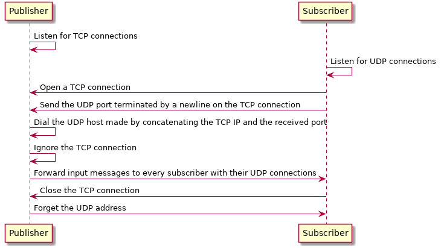

# `bullhorn` Design

`bullhorn` allows data to be sent on a network from publishers to subscribers
(3).

This is done via a pub/sub system which operates over UDP with a TCP trunk. The
TCP trunk allows the publisher to know when to stop publishing to subscribers
and lets the subscriber know when it needs to try to reconnect to a publisher if
reconnect is enabled. The unreliable UDP connection is fine because mostly
periodic statuses are sent through the system.

The publisher will publish all newline-separated lines it receives over STDIN to
every subscriber until STDIN is closed.

The subscriber prints all newline-separated lines it receives from the
publisher until the publisher is closed if reconnect isn't enabled. The
subscriber never closes if reconnect is enabled and will just periodically
attempt reconnects. The subscriber will always exit with a failure to connect
unless terminated because it will either try to reconnect forever or fail to
connect to a terminated publisher.
