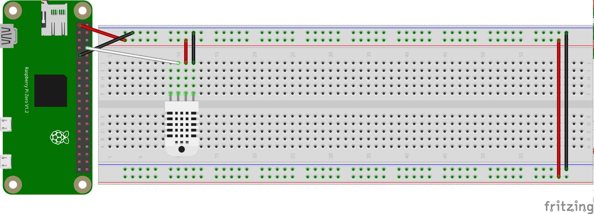
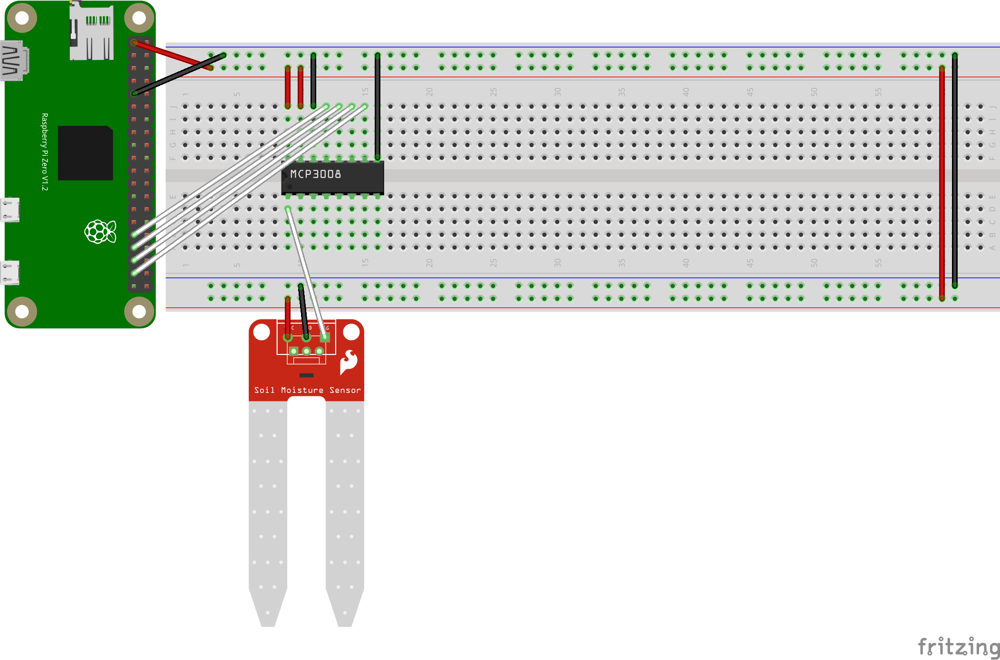
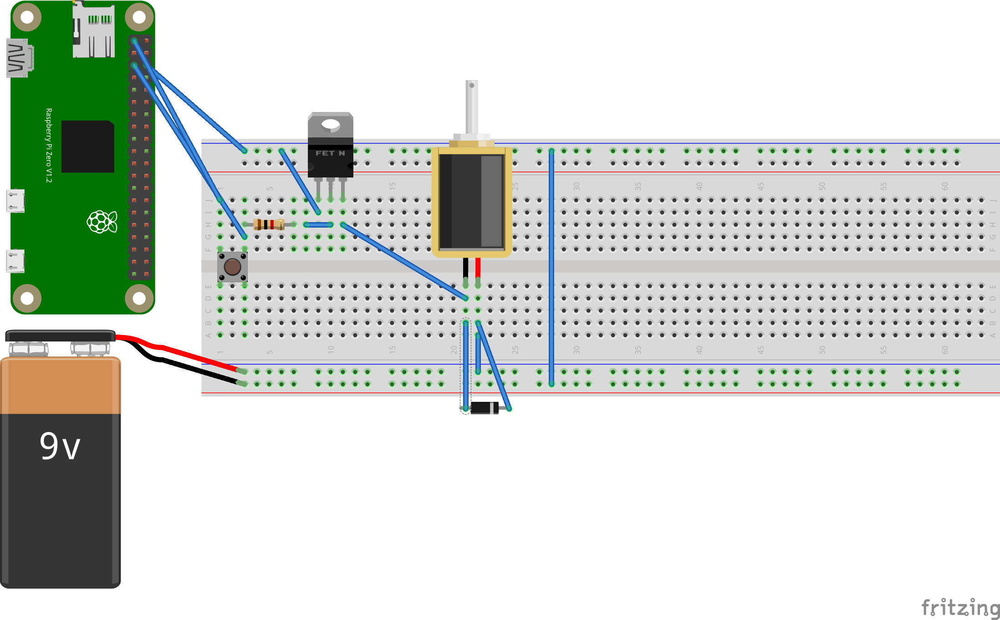

# `device` Design

`device` programs write `greenerthumb` JSON message bodys from sensors to
STDOUT.

These can be `fan`ned into `message/bytes` piped into `bullhorn/publish` after
wrapping with headers.

## Sensors

### `air-sensor`

`air-sensor` senses the 'Air Status Message' body at 0.1 hertz.

### `soil-sensor`

`soil-sensor` senses the 'Soil Status Message' body at 0.1 hertz.

### `waterer`

`waterer` opens a solenoid valve based on a logic signal or a button press.

The 9v battery in the diagram is really a 12v source and the solenoid is a
solenoid valve.

The chain of components includes the logic pin and a 3.3v source in parallel
connected to a 1kOhm resistor to limit current draw. The resister is connected
to the base of a transistor which provides isolation.

On the other side of the transistor, 12v power goes into the solenoid's cathode.
A diode is connected in parallel across the solenoid to prevent reverse current
flow. The anode of he solenoid is connected to the transistors collector. The
transistor's emitter and the 12v sources ground are both shorted to the Pi's
ground.

The waterer isn't implemented yet.

## Emulators

Emulators are provided for all programs and each accepts an optional rate flag.
