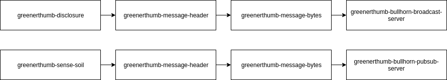
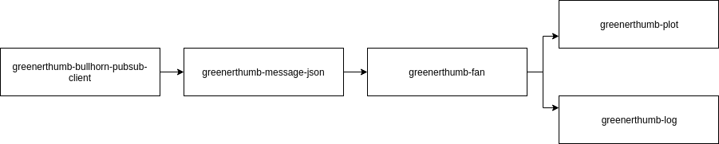

# `greenerthumb` Design

`greenerthumb` is implemented with a subprogram approach. This allows each
sensor or client to be implemented with the least extra code and the most reuse
of tests. It also simplifies using different languages where they make sense. An
example is that this facilitates using Python for the sensors where library
support is excellent, Go for infrastructure where efficiency is important, and
c++ for GUIs where OpenGL bindings are mature.

Some downsides of this architecture are working with the paths to the
subprograms, remembering all the necessary subprograms for a task, and
messaging. An activate.sh/deactivate.sh pair is provided to mitigate the first
problem. The scripts create aliases to all programs such that they can be run
from anywhere.  The second problem is addressed by giving composite scripts for
some useful combinations of subprograms. Finally, internal messaging is handled
by passing JSON lines from STDIN to STDOUT. This allows subprograms to not have
to understand the messages, just how to handle JSON

Subprograms are described in later sections. Some of the subprograms also
fulfill requirements themselves. An example of this is the `process`
subprograms. Several major composite programs are provided:

## `run-air`

## `run-soil`

## `run-disclosure`

## `run-logger`

## `run-plotter`

