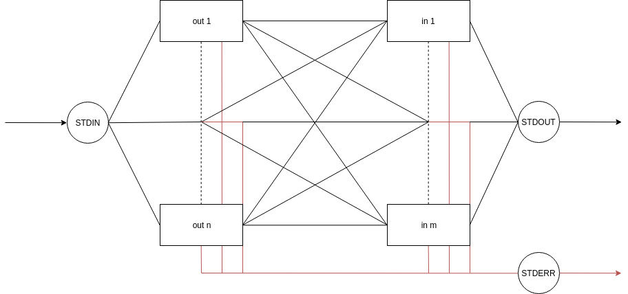

# `fan` Design

`fan` connects its STDIN to the STDINs of listed out-programs and STDOUTs from
listed out-programs to STDINs of listed in-programs.

Once data is written to `fan`'s STDIN, it gets written to the STDIN of all the
in-programs. All of the in-programs' STDOUTs is copied into all of the
out-programs' STDIN. All of the out-programs' STDOUT is then recombined and
copied to `fan`'s STDOUT. Every program's STDERR is copied to `fan`'s STDERR.
An in or out program failing just filters out that program and the rest of `fan`
keeps running. `fan` exits once all of its programs exit.
