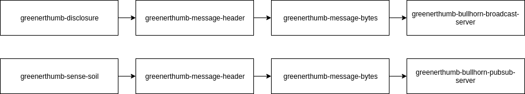
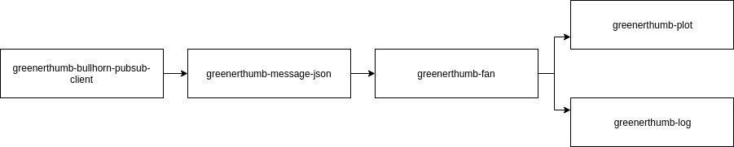

# `run` Design

`run` contains implementations of runners for components. The runners are
implemented by composition of subprograms which allows the to be flexibally
modified without recompilation. Before running, `util/activate.sh` needs to be
sourced from the project root after building the right component.

## `greenerthumb-run-air`

`greenerthumb-run-air` runs the air temperature sensing device.

## `greenerthumb-run-soil`

`greenerthumb-run-soil` runs the soil moisture sensing device.

## `greenerthumb-run-logger`

`greenerthumb-run-logger` runs a logger which receives messages from a signle
publisher.

## `greenerthumb-run-plotter`

`greenerthumb-run-plotter` runs a plotter which receives messages from a single
publisher.

