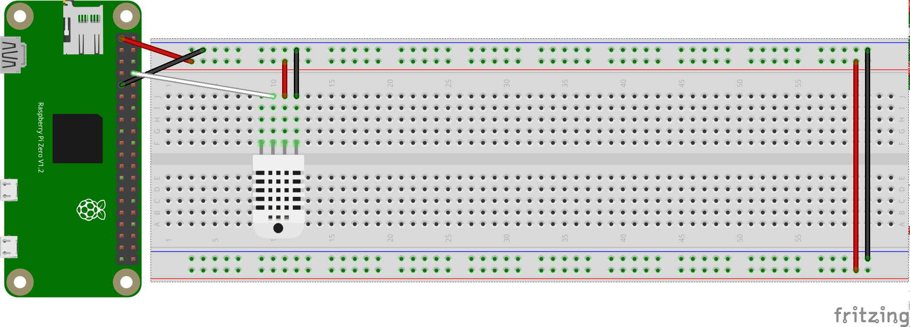
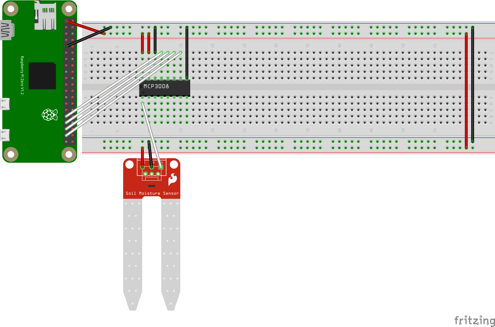

# `sense` Design

`sense` writes `greenerthumb` JSON messages from sensors to STDOUT.

## Programs

### `air`

`air` senses the 'Air Status Message' at 0.1 hertz.



### `soil`

`soil` senses the 'Soil Status Message' at 0.1 hertz.



## Emulators

Emulators are provided for all programs and each accepts an optional rate flag.

## Examples

### `air`

```
./air

{"Name": "Air", "Timestamp": 0, "Temperature": 67.4}
```

### `soil`

```
./soil

{"Name": "Soil", "Timestamp": 0, "Moisture": 0.37}
```
